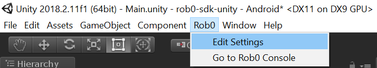
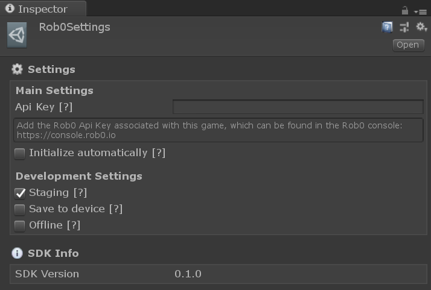

# Getting Started with Rob0 Unity SDK

Welcome to your Dashboard, here’s all the info you need to be able to link your projects to your Rob0 Console.

## System requirements

The Rob0 SDK is still under development, and we’re working hard to add support to all platforms, although it may very well already work on platforms not listed below. It has currently being tested using the following configurations:

* Unity 2017 or above 
* iOS, Android and Standalone (PC or macOS)

### Recommended settings

In order to leverage the latest features that Unity has developed to reduce lag when reading from the GPU, the recommended settings are:

- To deploy on Android:
  - Unity 2018.1 or above
  - Vulkan graphics API
- To deploy on iOS:
  - Unity 2018.3 or above
  - Metal API
- To deploy on PC or Mac:
  - Unity 2018.1 or above
  - Graphics API that allows asynchronous GPU read back

Not sure if Rob0 is going to work in your specific configuration or need support for the earlier versions of Unity? Feel free to reach us via Intercom or email.

## Adding Rob0 to your app

### Create App on the console

To start using Rob0, you have to create a [free account](http://console.rob0.io/signIn) and login to the Rob0 Console, which provides a web interface to manage all Rob0 services.

1. Login to [Rob0 Console](http://console.rob0.io)
2. Create New Project
3. Complete the project name and description

### Configure Rob0 Editor Plugin

1. [Download the rob0 Unity SDK](https://s3.amazonaws.com/downloads.rob0.io/rob0-sdk-unity.unitypackage)
2. In your Unity project go to **Assets -> Import Package -> Custom Package…**
3. Select `rob0-sdk-unity.unitypackage` and import all assets

4. After importing, configure Rob0 App Key, go to **Rob0 -> Edit Settings**

5. Add the Rob0 App Key for your project

This is your Rob0 Api Key:

{{ApiKey}}

## Start using Rob0

At this point, you should be able to start using Rob0. Play with your app a little bit and minimize it. A snapshot of the last minute of use will be sent to the Rob0 Console (this might take a minute or two).

_Note: This also works in the editor, but in order to trigger the upload you need to switch to a different application while Unity is still running your project._

## Known issues

* In order for the recording to work, all UI Canvas need to render to a camera.
* In order to capture screenshots without impacting performance we use `Rendering.AsyncGPUReadback` which is only available in Unity 2018.1 for Android using the Vulkan graphics API and Unity 2018.3 for iOS. If you're unable to use the latest versions of Unity you may experience a slight performance impact on older devices.
* Since iOS interrupts all web requests once the app is minimized, you'll need to manually trigger an upload using `Rob0.Rob0Controller.SendCapsule("your-custom-event-name");`. We're currently working on a solution that would use background tasks.
