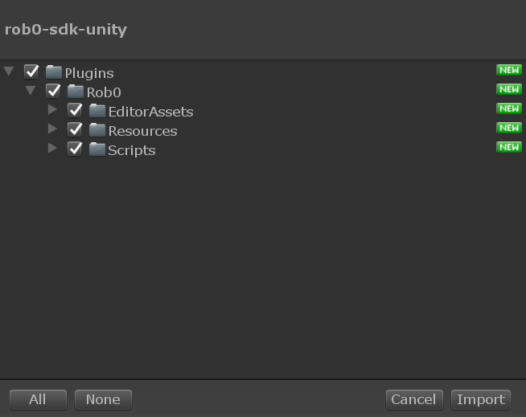

# Getting Started with Rob0 Unity SDK

Welcome to your Dashboard, here’s all the info you need to be able to link your projects to your Rob0 Console.

## System requirements

The Rob0 SDK is still under development, and we’re working hard to add support to all platforms, although it may very well already work on platforms not listed below. It has currently being tested using the following configurations:

* Unity 2017 or above 
* iOS, Android and Standalone (PC or macOS)

### Recommended settings

In order to leverage the latest features that Unity has developed to reduce lag when reading from the GPU, the recommended settings are:

- To deploy on Android:
  - Unity 2018.1 or above
  - Vulkan graphics API
- To deploy on iOS:
  - Unity 2018.3 or above
  - Metal API
- To deploy on PC or Mac:
  - Unity 2018.1 or above
  - Graphics API that allows asynchronous GPU read back

Not sure if Rob0 is going to work in your specific configuration or need support for the earlier versions of Unity? Feel free to reach us via Intercom or email.

## Adding Rob0 to your app

### Create App on the console

To start using Rob0, you have to create a [free account](http://console.rob0.io/signIn) and login to the Rob0 Console, which provides a web interface to manage all Rob0 services.

1. Login to [Rob0 Console](http://console.rob0.io)
2. Create New Project
3. Complete the project name and description

### Configure Rob0 Editor Plugin

1. [Download the rob0 Unity SDK](https://s3.amazonaws.com/downloads.rob0.io/rob0-sdk-unity.unitypackage) ([Release Notes](./getting-started.md#release-notes))
2. In your Unity project go to **Assets -> Import Package -> Custom Package…**
3. Select `rob0-sdk-unity.unitypackage` and import all assets

4. After importing, configure Rob0 App Key, go to **Rob0 -> Edit Settings**

5. Add the Rob0 App Key for your project

This is your Rob0 Api Key:

{{ApiKey}}

## Start using Rob0

At this point, you'll be able to start using Rob0. Run your app and you should start seeing your device and session data appear in the console. After about a minute (or whenever you pause/minimize your app) you'll see new capsules ready for viewing.

In the devices section of the console you'll be able to define which devices to stream from or if to only record specific event triggers.

Note that capsules are only sent if the device is connected to Wifi to avoid consuming network data.

## Known issues

* In order for the recording to work, all UI Canvas need to render to a camera. The script `CanvasCameraSetter` can be attached to any Canvas gameobject to automatically set it to Camera Space and attach the main camera to it.
* In order to capture screenshots without impacting performance we use `Rendering.AsyncGPUReadback` which is only available in Unity 2018.1 for Android using the Vulkan graphics API and Unity 2018.3 for iOS. If you're unable to use the latest versions of Unity you may experience a slight performance impact on older devices.
* Since iOS interrupts all web requests once the app is minimized, you'll need to manually trigger an upload using `Rob0.Rob0Controller.AddEvent("your-custom-event-name");`. We're currently working on a solution that would use background tasks.

## Release notes

### Version 0.5.0 - 2019/11/16

**Features**
- Streaming support to record full gameplay sessions
- Added utility script for automatically setting UI canvas to camera space

**Improvements**
- Use microseconds to define event time
- Better session events synchronization
- Improved API security
- Skip capsule upload if no inputs detected

**Bug Fixes**
- Fix ftux events in live mode
- Fix frame skipping issue that caused faster video playback in console

### Version 0.4.4 - 2019/06/12

**Features**
- Added ability to add custom data to any event

**Improvements**
- Event's data changed to `object`, so anything that can be serialized will be included with event
- Stop recording when backend quota is reached

**Bug Fixes**
- Reset input data on each new event
- Prevent events from using the same capsule id

### Version 0.4.0 - 2019/04/09

**Features**
- Backend API will now inform SDK which events to capture
- Removed function `SendCapsule` as capsules will be send according to events of interest
- Added ability to record capsule before, after or around events

**Improvements**
- Better handling of pause event in Unity Editor

**Bug Fixes**
- Fix capsule frame rate to 30fps (this is for inputs and metadata, image fps is controlled by backend)

### Version 0.3.0 - 2019/03/19

**Features**
- Record session information in the form of events
- Created `AddEvent` function to add custom events including data

**Improvements**
- First time an event is detected in live mode, it will be tagged as ftux
- Add option to stop recording based on CPU usage
- Optimizations for recording screen

**Bug Fixes**
- Don't reset settings when upgrading SDK
- Default to 30 fps if `Application.targetFrameRate` is not set
- Clear cache when settings change to not save capsule on disk

### Version 0.2.2 - 2019/02/18

**Improvements**
- Remove automatic rob0 popup asking to enter device name

### Version 0.2.1 - 2019/02/05

**Bug Fixes**
- Change default settings

### Version 0.2.0 - 2019/01/23

**Features**
- Capsule player included in SDK

**Improvements**
- Simulate application minimize when Editor is paused

